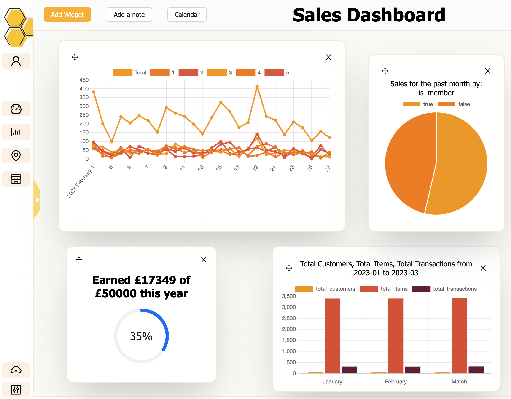
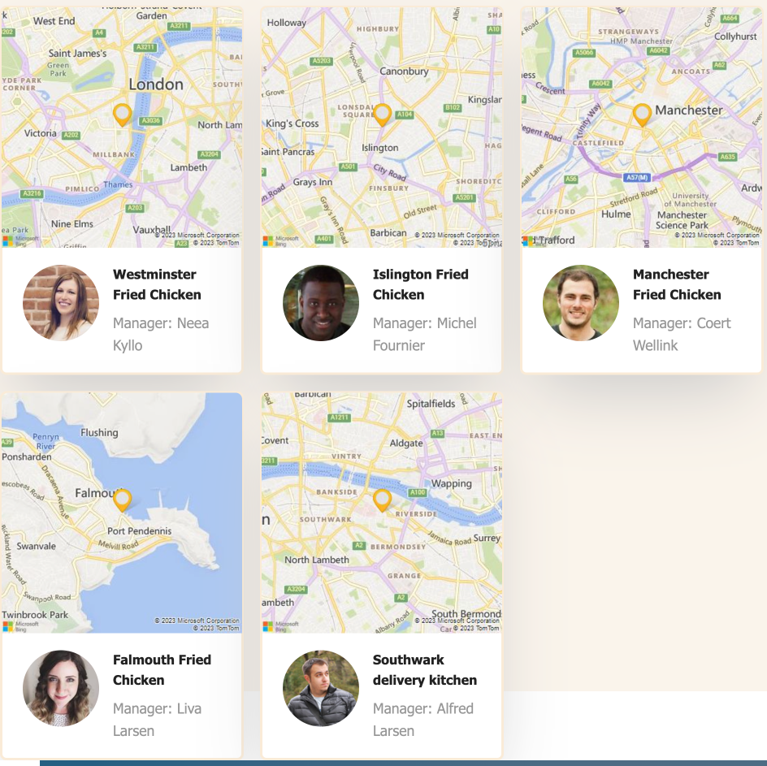
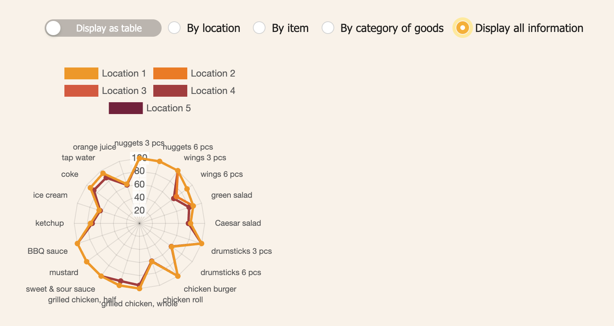
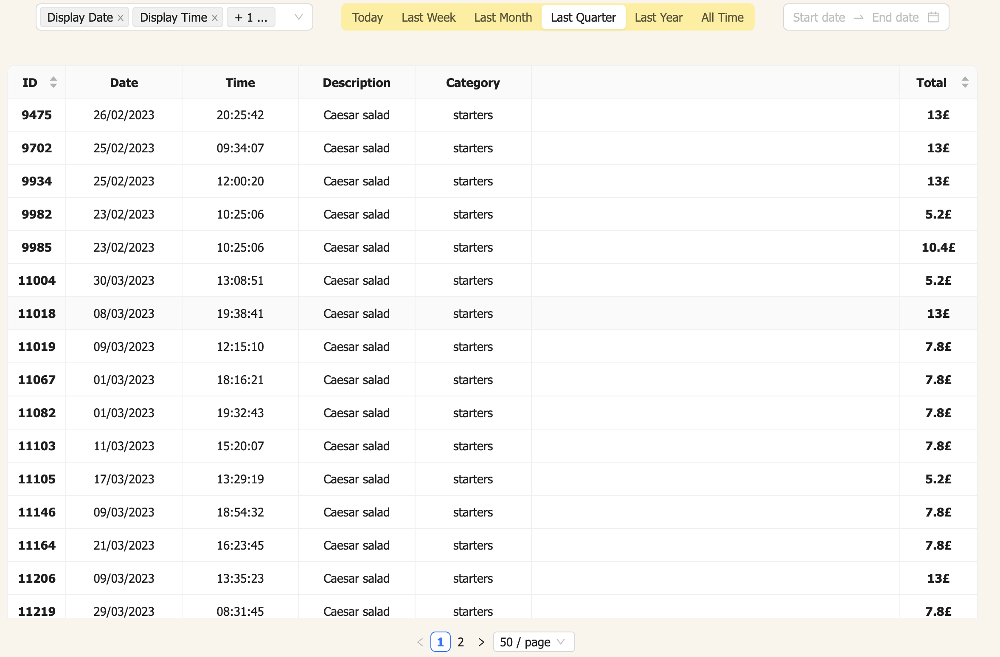

#BizBuzz

BizBuzz is a CRM and data visualisation tool for small businesses. It was created by Marzena Gromowska, Anton Novak, Xavi Vide, and Andrew Pearson, as their thesis project at CodeWorks boot camp.

BizBuzz is a CRM and data visualisation tool for small businesses. It was created by Marzena Recio Gromowska, Anton Novak, Xavi Vide, and Andrew Pearson, as their thesis project at CodeWorks boot camp.

A video explanation of this app can be found at https://www.youtube.com/watch?v=-1rLdExL68s&ab_channel=XaviVide.

###What it does

BizBuzz provides a range of options for visualising data on sales, available through modules of the app. The most comprehensive data can be found in the 'reports' module, which lists all transactions within a user-selected timeframe. These transactions can be filtered by characteristics of the transaction, item sold, location of sale, and customer.

The dashboard contains the widest range of tools for summarising data - bar charts, line graphs, and pie charts, again all filterable by a wide variety of characteristics of the transaction. The dashboard also holds onto user notes and calendar, and retains its state upon reload enabling the user to keep key statistics immediately accessible whenever the leave and reopen the app.

Other features accessible through the front end include inventory management visualisation, either as a table or as a radar chart, and management of information about business locations.

The app has a smooth and intuitive GUI.

The app provides reassurance to clients against the possibility of data leak, firstly through secure authentication and secondly by providing separate database tables for every individual user.

###Under the hood

This app was written end-to-end in TypeScript. The front end uses React and Next.js; the back end uses an Express server and a PostgreSQL database accessed through Prisma. Authentication is achieved using Bcrypt.

The app uses a variety of sophisticated custom functions to translate easily-comprehensible user instructions into complex queries, and to translate the returned information into digestible formats.
